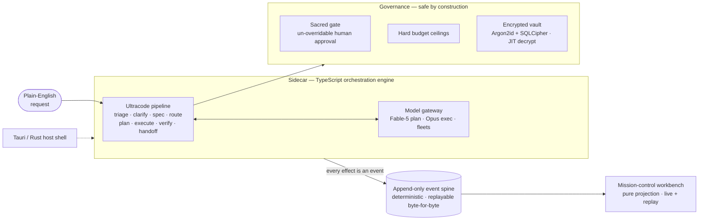

 

### I don’t just *use* AI — I run fleets of it like an engineering org.

Written briefs · hostile critique loops · hard human gates · autonomy made safe by construction.

 

---

## ✦ Featured — ORRERY

> **A governed, local-first, multi-agent / multi-model AI workflow manager.**
> It turns plain-English requests into *verified* work by orchestrating agents under strict
> governance — hard budgets, an un-overridable human approval gate, and a deterministic,
> append-only, event-sourced spine you can always replay and trust.

**The top-level run** — a request flows left-to-right, orchestrated across model tiers, fenced by governance, recorded on one event spine, and watched live in the workbench:

<b>🛡 Governance — where autonomy ends, on purpose</b>

 

- **Sacred gate** — destructive actions park for a human; no model can talk its way past it.
- **Hard budgets** — token/step ceilings **block on breach** instead of silently truncating.
- **Capability is never inferred** — tool authority comes only from an explicit granted allowlist, carried by least-privilege spawn envelopes through a five-plane permission gate.
- **Encrypted vault** — provider keys live under Argon2id + SQLCipher, decrypt just-in-time, and never touch disk in plaintext.

<b>🎞 Determinism — the audit trail and the program are the same object</b>

 

- **Append-only spine, single per-run writer** — every effect is an event.
- **Pure projections** — every view is a fold over the event bus; **no wall-clock or RNG** in anything a reducer sees.
- **Replay is byte-identical** — re-run any log and get the exact same state, every time.
- **Rust ↔ TypeScript hash parity** — the `Event` schema is byte-for-byte identical across the host and the engine.

<b>🧩 Architecture — four surfaces, one contract</b>

 

| Surface | Role |
|---|---|
| `src-tauri/` + `crates/` | Tauri / Rust host shell + the encrypted credential vault |
| `sidecar/` | TypeScript orchestration engine: event spine, Ultracode pipeline, model gateway, governance, budgets, tool suite, shared memory |
| `frontend/` | React / WebGL *mission-control* workbench — a pure projection consumer; mutates state only via `POST /command` |
| `packages/` | the shared `Event` schema — the spine contract, byte-parity across Rust and TS |

Verified by one gate: `pnpm verify` → typecheck · tests · lint · secrets-grep · Rust↔TS parity · replay-determinism.

> [!NOTE]
> ORRERY’s source is private. Shown here at the top level — architecture, guarantees, and capabilities — with no implementation exposed. Walkthrough or gated access available on request.

---

## What else I build

Autonomy made safe by construction, across a portfolio of live and study systems:

| Project | What it is |
|---|---|
| **Autonomous content engines** | 4 self-running publishing engines (~50 crons) behind a hard publish gate |
| **Bookings-recovery system** | turns missed enquiries into recovered revenue, end-to-end |
| **Assistant SaaS** | a hosted AI assistant product |
| **Pattern studies** | two focused deep-dives into agentic patterns |

Most are private or gated. Details and demos available on request.

---

## How I work

- **Briefs before code** — every build starts from a written mission + invariants.
- **Hostile critique loops** — findings are adversarially verified before they’re trusted.
- **Human gates everywhere** — zero unattended commits; destructive actions always stop for a person.
- **Proof, not vibes** — 1,000+ tests, deterministic replay, and a single CI gate that must pass.

---

## Toolbox

---

### Reach me

Portfolio is PIN-gated — happy to share on request.

